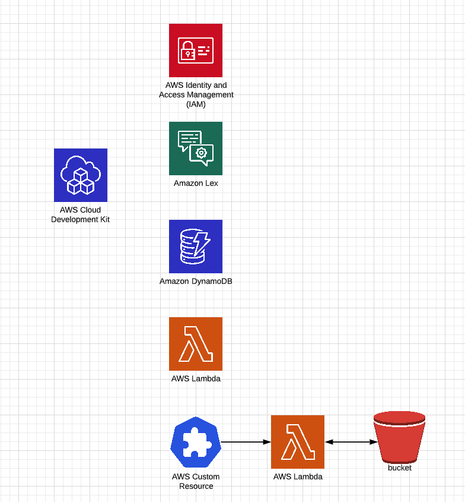
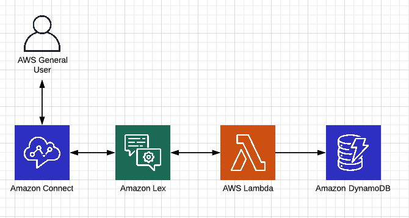

# vanity-numbers-project

James McNeill

## Deployed Resources

## Architecture Diagram

## Connect phone number

Connect phone number of my environment: +44 800 032 2336

## Problem

Create a Lambda that converts phone numbers to vanity numbers and save the best 5 resulting vanity numbers.

I had the following thoughts:
The more digits that could be converted to words the better
Repeating words would also be good

With this in mind I did the following:

## Proposed solution

Split the phone number into an array based on a regular expression to exclude +, 0 and 1 so for example +94308430843 would become [943, 843, 843]
I then took a count of any repeating digits and stored this for each number sequence.
Then sorted the array by length and if 2 number sequences had the same length by number of times repeated.
I then targeted this number sequence for conversion to a word, in the above example 843

I went on to generate all of the letter combinations for the number sequence and then checked them against a list of around 10,000 most popular english words I found online.
I tried to generate all the max size first in this case 3, then 1 less down to 1 letter.

When I finished getting my word I then replaced all instances of my letter combination so say in the example 
843 would match with tie, I would replace all instances of 843 in the original number with tie giving +9430tie0tie
But also 43 matches with hd. So I would replace all instances of 43 in the original number with hd giving +9hd08hd08hd
I feel this results in the best vanity number possibilities for the phone numbers.

With more time I would have liked to flip my approach around and tried the following:
Convert all 10,000 words into number sequences
Order these by size then search for those number sequences in the dialled number
I'm not sure how or if I could have dealt with the repeating digits in the dialled number using this approach but would have liked to try it out

I tried to time box how long I spent on this portion of the task before moving on to the other tasks

## Infrastructure

I then created a contact flow in the console and immediately had the idea of introducing a lex instance between connect and the lambda to enable some customer interaction
If time had permitted I would have liked to introduce a few more intents, giving the user the chance to enter another phone number instead of just working on their own number

I created the lex bot and the dynamo db in the console, granted the appropriate permissions between everything and verified that it all worked.

Then onto the CDK, I feel I am familiar with created lambda, IAM roles and lex instances in CDK so was able to complete this pretty quickly,
I just had to spend a small amount ot time figuring out DynamoDB

I then started to tackle the custom resource and having never done this before invested a bit of time eventually landing on the following approach

Update the CDK to upload the contact flow JSON to an s3 bucket
Create a custom resource backed by a lambda, passing in the s3 bucket and the bot alias arn
In the lambda:
    download the contact flow from the s3 bucket,
    parse through the JSON to find the BotAliasArn,
    replace its value with the new arn passed in
    upload back to s3 again
Back in the CDK again I then output the url of the s3 bucket so it could be clicked through to after a cdk deploy

With more time I would love to explore how to interact with the Connect api to update the flow through code

## Other Considerations

Locking down IAM access to invidiual resources
More error checking
More unit tests
Integration testing using lambda local
Performance test of the solution I went with vs starting with the dictionary

## Deploy Instructions

Designed to be deployed through CDK deploy

Will need:

npm i
aws cli
aws configure to have been ran
cdk bootstrap set up for account and region

then run:

cdk deploy

will output the url of the s3 bucket with the fresh aws connect contact flow complete with new bot alias arn filled in

Manual steps

Amazon connect
go to contact flows
within amazon lex section
select bot: james-mcneill-vanity-numbers-bot
select alias: james-mcneill-vanity-numbers-alias
click add amazon lex bot

then log in to amazon connect instance
click contact flows and then create contact flow
click drop down beside save and import flow
import the flow you downloaded from s3 earlier
click save
click publish

back in amazon connect instance dashboard click phone numbers
claim a phone number
select a phone number
select the new contact flow from the Contact flow / IVR drop down and click save